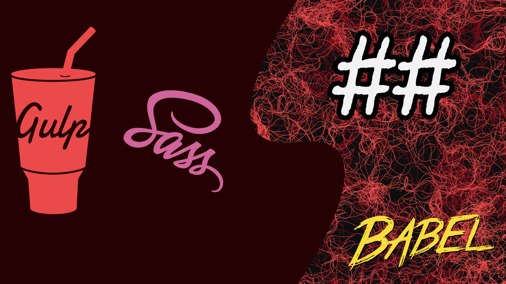

# gulp-4-yt

Gulpjs series where I go over the basic 
content:
- intro 
- gulp tasks ( series & parallel )
- compiling SCSS
- cleaning/minifying CSS
- compiling JS
- cleaning/minifying JS
- File watchers
- browsersync

watch it [here](https://www.youtube.com/playlist?list=PLM0LBHjz37LVNapdMeupY-SevP4TrgVxZ)

